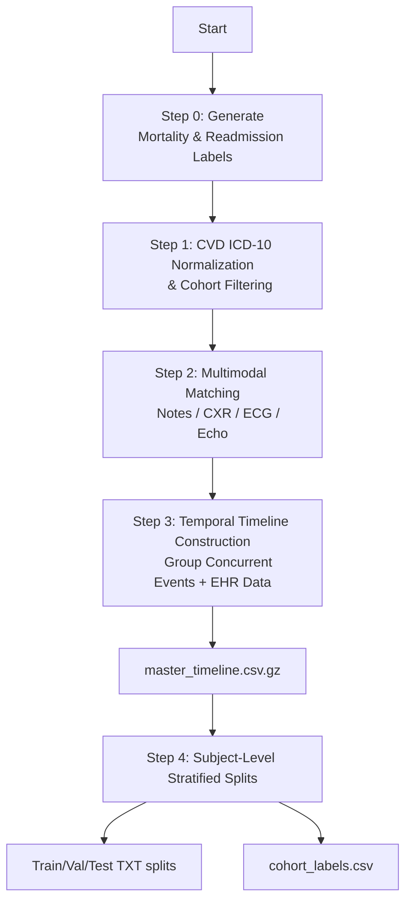

# 🩺 1. Project Goal

This pipeline provides a fully automated, research-grade data processing workflow designed to extract a Cardiovascular Disease (CVD) patient cohort from the MIMIC-IV (v3.1) database. It constructs a **strictly time-aligned, multimodal temporal dataset** by matching clinical events that occurred during a patient's hospitalization.

The extracted modalities include:

- **Notes:** Clinical texts such as discharge summaries and radiology reports.
- **CXR:** Chest X-ray images, metadata, and CheXpert labels.
- **ECG:** Electrocardiogram waveforms and automated machine measurements.
- **Echo:** Echocardiography study lists and DICOM file paths.
- **EHR Data:** Laboratory tests, prescriptions, and ICU procedure events[cite: 6].

The final outcome is a leakage-free, temporally aligned multimodal CVD inpatient cohort, directly usable for machine learning model training, risk prediction, and clinical sequence modeling.

---

# 📁 2. Directory Structure

The following illustrates the output directory structure used by the pipeline (abstracted as the `PATHS` dictionary in the code):

```text
/home/ma-user/work/Data/CVD_MMData/
│
├── mimiciv/3.1/hosp/                 # Admissions, ICDs, Labevents, Prescriptions
├── mimiciv/3.1/icu/                  # ICU stays, Procedureevents
├── mimiciv/note/                     # Clinical notes
├── mimiciv/cxr/                      # CXR metadata and CheXpert labels
├── mimiciv/ecg/                      # ECG machine measurements
├── mimiciv/echo/                     # Echo study metadata
│
└── temporal_output_norm_icd10/       # 🌟 Pipeline Output Root
    ├── step0_death_admissionlabel/   # Outcome labels (Mortality & Readmission)
    ├── step1_cvd_filter/             # ICD normalization & CVD cohort filtering
    ├── step2_multimodal_matching/    # Time-window matched multimodal paths
    ├── step3_temporal_timeline/      # Master temporal timeline & EHR events
    └── step4_labels_splits/          # Clean labels & leakage-free subject splits
```

---

# 🧩 3. Processing Pipeline

The complete workflow consists of five sequential processing steps: **Step 0 → Step 1 → Step 2 → Step 3 → Step 4**[cite: 6].

---

# 📝 Step 0 — Mortality and Readmission Label Generation

**Purpose:** Generate prediction labels for each hospital admission (`hadm_id`).

### ✔ Input Files

- `admissions.csv.gz` (admission/discharge times).
- `patients.csv.gz` (date of death).
- `diagnoses_icd.csv.gz` (diagnoses).
- `icustays.csv.gz` (ICU admission records)[cite: 6].

### ✔ Output Labels

| Field                 | Meaning                             |
| --------------------- | ----------------------------------- |
| mortality_in_hospital | Death occurred during admission     |
| mortality_30d         | Death within 30 days post-discharge |
| readmission_30d_hosp  | Hospital readmission within 30 days |
| readmission_30d_icu   | ICU readmission within 30 days      |

---

# 💓 Step 1 — CVD Cohort Filtering & ICD-10 Normalization

**Purpose:** Identify CVD-related admissions and strictly map ICD-9 diagnostic codes to ICD-10.

- Categorizes diseases into Coarse (e.g., Ischemic Heart Disease) and Fine categories using reference CSVs.
- Applies a strict normalization process using the official GEMs table (`icd9toicd10cmgem.csv`)[cite: 6].
- **Strict Filtering:** Records with ICD-9 codes that fail to map to ICD-10 are systematically dropped to maintain data integrity[cite: 6].
- **Output:** Generates the aggregated cohort file `step_1_cvd_cohort_[mode].csv.gz`[cite: 6].

---

# 🩻 Step 2 — Multimodal Data Extraction and Matching

Matches the Step 1 CVD cohort with four modalities using the **hospitalization time window**.

Matching rule:

> **Timestamp ∈ \[admittime - 24h, dischtime\]**[cite: 6]

- **2A Notes:** Matches clinical notes using `charttime`[cite: 6].
- **2B CXR:** Matches CXR metadata and DICOM image paths based on `StudyDate` and `StudyTime`[cite: 6].
- **2C ECG:** Matches ECG machine measurements and waveform paths[cite: 6].
- **2D Echo:** Matches Echo study metadata and DICOM paths[cite: 6].

---

# ⏱️ Step 3 — Temporal Timeline Construction

**Purpose:** Builds a master temporal sequence grouping concurrent events relative to the admission time[cite: 6].

- Calculates a `time_offset_hours` for every clinical event[cite: 6].
- Concurrently extracts and bundles structured EHR data (`labevents`, `prescriptions`, `procedureevents`) into the timeline[cite: 6].
- **Output:** Generates the standardized `master_timeline_[mode].csv.gz` and detailed grouped files (`details_notes_grp.csv.gz`, `details_lab_grp.csv.gz`, etc.)[cite: 6].

---

# 🛡️ Step 4 — Subject-Level Splits & Clean Labels

**Purpose:** Creates physically isolated dataset splits to prevent data leakage during model training[cite: 6].

- Generates a stratification key (`strat_key`) combining the primary CVD category and 30-day mortality status (`mortality_30d`)[cite: 6].
- Executes a strict Subject-Level split: **70% Train / 10% Validation / 20% Test**[cite: 6].
- **Output:** Produces `[train/val/test]_subjects_[mode].txt` ID lists and a clean label dataset (`cohort_labels_[mode].csv`)[cite: 6].

---

# ▶ Running the Code

The script supports two running modes via command-line arguments[cite: 6].

**1. DEBUG Mode (Fast Testing)**
Processes a small subset of patients (~1000 subjects) who possess intersecting data across CXR, ECG, Echo, and Notes. Ideal for testing pipeline execution and verifying outputs[cite: 6].

```bash
python extract_temporal_multimodal_normicd10_cvd_3.py --mode DEBUG
```

**2. ALL Mode (Full Dataset Generation)**
Processes the entire MIMIC-IV dataset to build the complete, research-ready multimodal cohort[cite: 6].

```bash
python extract_temporal_multimodal_normicd10_cvd_3.py --mode ALL
```

---

# 📌 Appendix A — CVD Classification System

The CVD matching in this project is based on a **two-tier classification system**[cite: 7]:

- **Coarse Categories**: Grouped by organ system or major disease class[cite: 7].
- **Fine Categories**: Correspond to common clinical subtypes (e.g., STEMI, NSTEMI, TIA, etc.)[cite: 7].

### 🟥 Coarse Categories + ICD Ranges

The following corresponds to `CVD_coarse_category.csv` in the code[cite: 7]:

| InternalCode | ICD9 Range | ICD10 Range   | English Name                                                | 中文名称             |
| ------------ | ---------- | ------------- | ----------------------------------------------------------- | -------------------- |
| **CVD_A**    | 390–398    | I00–I09       | Rheumatic heart diseases                                    | 风湿性心脏病         |
| **CVD_B**    | 401–405    | I10–I16       | Hypertensive diseases                                       | 高血压及相关心血管病 |
| **CVD_C**    | 410–414    | I20–I25       | Ischemic heart diseases                                     | 缺血性心脏病         |
| **CVD_D**    | 415–417    | I26–I28       | Pulmonary heart disease and pulmonary circulation disorders | 肺心病及肺循环疾病   |
| **CVD_E**    | 420–429    | I30–I52 / I5A | Other heart diseases                                        | 其他心脏疾病         |
| **CVD_F**    | 430–438    | I60–I69       | Cerebrovascular diseases                                    | 脑血管疾病           |
| **CVD_G**    | 440–448    | I70–I79       | Arterial / arteriolar / capillary diseases                  | 动脉与微血管疾病     |
| **CVD_H**    | 451–459    | I80–I89       | Venous and lymphatic diseases                               | 静脉、淋巴管疾病     |

---

# 📚 Appendix B — PhysioNet Data Sources

The following lists all official PhysioNet data sources used in this project, including version numbers and access links, for reproducibility and environment setup[cite: 7].

| Data              | Version | PhysioNet Link                                   |
| :---------------- | :------ | :----------------------------------------------- |
| **MIMIC-IV Core** | v3.1    | https://physionet.org/content/mimiciv/3.1/       |
| **MIMIC-IV Note** | v2.2    | https://physionet.org/content/mimic-iv-note/2.2/ |
| **MIMIC-CXR**     | v2.1.0  | https://physionet.org/content/mimic-cxr/2.1.0/   |
| **MIMIC-IV ECG**  | v1.0    | https://physionet.org/content/mimic-iv-ecg/1.0/  |
| **MIMIC-IV Echo** | v0.1    | https://physionet.org/content/mimic-iv-echo/0.1/ |

---

# 📊 Appendix C — Multimodal Matching Flowchart (CVD Pipeline)

The following diagram illustrates the entire CVD multimodal data processing pipeline, from Step 0 label generation through to Step 4 dataset splitting.


